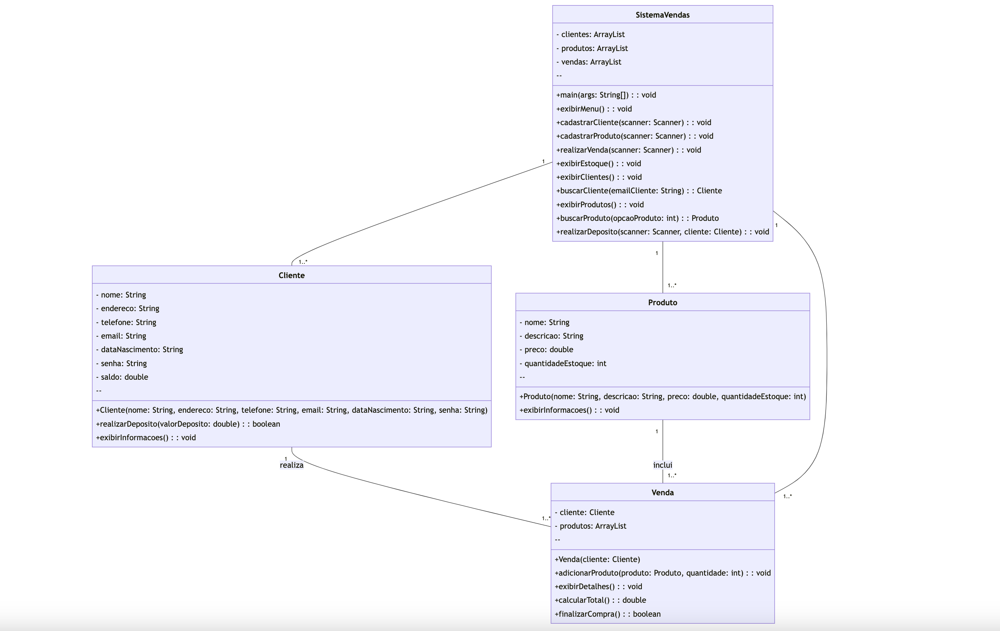

# Sistema Net Shoes
Desenvolvido para eficiência no gerenciamento de clientes, produtos e vendas, oferece uma solução completa.

uma experiência intuitiva, atendendo à busca de usuários por simplicidade e otimização em suas operações comerciais. 

## Funcionalidades Principais

### Cadastro de Clientes:

* Registre informações detalhadas dos clientes, incluindo nome, endereço, telefone, e-mail, data de nascimento e senha.

* Atribui automaticamente um saldo inicial de 100 reais ao cliente no momento do cadastro.

### Cadastro de Produtos:

* Facilita o registro de produtos com informações essenciais como nome, descrição, preço e quantidade em estoque.

* Permite uma gestão eficiente do inventário, garantindo visibilidade total dos itens disponíveis.

### Realização de Vendas:

* Possibilita a realização de vendas de forma intuitiva, incluindo a seleção de produtos e quantidade desejada.

* Associa cada venda a um cliente, debita o valor no saldo do cliente e ajusta a quantidade do produto no estoque.

### Gestão de Estoque:

* Permite o controle preciso do estoque, incluindo a gestão de entrada e saída de produtos.

* Facilita a identificação de produtos com baixo estoque, evitando interrupções nas vendas.

## Como Utilizar
### Cadastro de Clientes:

* Execute o método cadastrarCliente(scanner) na classe Main.

### Cadastro de Produtos:

* Execute o método cadastrarProduto(scanner) na classe Main.

### Realização de Vendas:

* Execute o método realizarVenda(scanner) na classe Main.

### Gestão de Estoque:

* Execute o método exibirEstoque() na classe SistemaVendas para visualizar as informações de estoque.
## Diagrama de Classe

### Requisitos
Java 8 ou superior.
JDK (Java Development Kit) instalado.
Contribuições
Contribuições são bem-vindas! Sinta-se à vontade para abrir problemas (issues) ou enviar pull requests para melhorar este sistema.

Aproveite a gestão simplificada e eficiente oferecida pelo Sistema Net Shoes!

## Projeto Codigo Base Java.
## Team - Grupo 8
* Alexandre Moreira - Scrum Master
* Heric Silva - Desenvolvedor
* Rian Rodrigues - Desenvolvedor
* Cesar Luna - Desenvolvedor

## Agradecimentos

* Agradecemos à Edu360 por ser uma instituição comprometida com a excelência educacional, proporcionando um ambiente de aprendizado estimulante e recursos de qualidade que contribuíram significativamente para nossa jornada de conhecimento em Java.

* A parceria entre a Foursys e a Edu360 tem sido um catalisador essencial em nossa trajetória educacional. Agradecemos à Foursys por reconhecer a importância de capacitar novos profissionais e por investir recursos significativos em programas de formação robustos, permitindo-nos adquirir habilidades técnicas e práticas essenciais para o sucesso na área de Java.